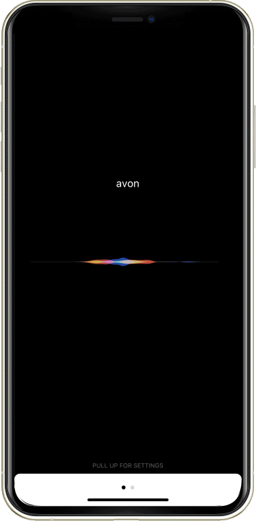

    

# Dalhousie Hackathon 2019
A ShiftKey Labs Hackathon hosted and in partner with Dalhousie University, which ran from November 25th to November 27th, 2019. The hackathon was open to all participants across Nova Scotia and was about solving a chosen challenge over the course of 48 hours, and then presenting that solution on the final day. 

## Challenge & Proposed Solution
Pedestrian and driver safety around the world is becoming more and more of a problem as more distractions
become available at our fingertips. Apps like Snapchat, Discord, and Slack have a tremdendous amount of users, however these apps have no voice integrations for assitants like Siri, which are limited to native apps only. 

Drivers stubbornly continue to use their phones despite the increase in risk to cause an accident. Avon seeks to eliminate this increased risk caused by the use of third party apps by adding voice integrations & passive commands such as alerts when a speeding threshold is breached when driving in certain areas. 

## Starting Up
After discussing what our solution to the issue would be, we started brainstorming features and how we'd implement those ideas into the application. To avoid confusion during developpement - we came up with a wireframe to follow as time went on.
  
The first page takes in voice input and recognizes commands via speech to text, while animating based on the decibal level of the input. While the Commands page lets you enable/disable commands as you see fit. The extensions page allows you to search for new extensions that were released and created by other users of the app, allowing for an infinite amount of possiblity. 

## Development
[Mackenzie Boudreau](https://github.com/mack) and [Jarret Terrio](https://github.com/sterrio) worked together to develop the iOS application.

## Issues
We faced various issues throughout the implementation of our ideas to our app. for the first 24 hours, the challenge was to decide whether or not we wanted to develop the app on iOS or Android. As Android offers more in terms of freedom to control the phone, however it did not have the polish we wanted that iOS could give. 

We also wanted to make sure that we could deliver a completely hands free functional assistant, and while we had a way to do so on iOS, we weren't sure if that would be a possibiblity on Android, as it needs some form of user touch before it can take in a speech to text input. 

## Result

    

## Future Plans
Figuring out integration of the passive commands would be plans for the near future, continuing into the far future development would be focused on getting integration and support for custom commands to be fully functional. Also, we had an odd error getting the application to run on actual phones rather than just the XCode simulated phones. Looking into this major issue would be the next task we take on. 
